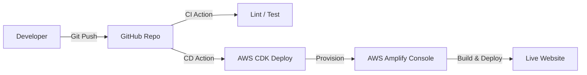

# プロジェクト計画書: Next.js + AWS Amplify モノレポ・スターターキット

## 1. プロジェクト概要

本プロジェクトは、モダンなWeb開発のベストプラクティスを集約したスターターキットを構築・公開することを目的とします。
「最速でWebサイトを立ち上げ、かつスケーラブルな基盤を提供する」ことをコンセプトとし、フロントエンドからインフラ(IaC)、CI/CDまでを一元管理します。

### 目標スコープ

- **フェーズ1 (今回):** Next.jsによるWebサイト構築と、AWS CDKを用いたAmplify Hostingへの自動デプロイ基盤の確立。
- **フェーズ2 (将来):** NestJS (バックエンド) とデータベースを含めたフルスタックアプリ基盤への拡張。

## 2. アーキテクチャ設計

### 2.1 技術スタック

| カテゴリ            | 採用技術                 | 選定理由                                                   |
| :------------------ | :----------------------- | :--------------------------------------------------------- |
| **Monorepo**        | **Turborepo**            | 高速なビルドキャッシュ、npm/pnpm/yarnとの親和性。          |
| **Package Manager** | **pnpm**                 | ディスク容量効率とインストールの高速性。                   |
| **Frontend**        | **Next.js (App Router)** | SEOに強く、Reactの最新機能(RSC)を活用可能。                |
| **Infrastructure**  | **AWS CDK (TypeScript)** | Amplify Consoleの設定をコードで管理(IaC)し、再現性を担保。 |
| **Hosting**         | **AWS Amplify**          | フロントエンドのホスティング、CI/CD連携の容易さ。          |
| **CI/CD**           | **GitHub Actions**       | テスト自動化およびCDKのデプロイパイプラインとして利用。    |

### 2.2 システム構成図 (概念)



## 3. ディレクトリ構造 (モノレポ構成)

将来的な拡張（NestJS等）を見据え、拡張性の高い構成を採用します。

```plaintext
my-monorepo/
├── apps/
│   └── web/                 # Next.js アプリケーション本体
│       ├── src/
│       ├── public/
│       ├── next.config.js
│       └── ...
├── infra/                   # インフラ構成 (AWS CDK)
│   ├── bin/
│   ├── lib/                 # Amplify Appのリソース定義
│   └── cdk.json
├── packages/                # 共有パッケージ
│   ├── ui/                  # 共有UIコンポーネント (Phase 2以降で真価を発揮)
│   ├── tsconfig/            # 共有TypeScript設定
│   └── eslint-config/       # 共有Lint/Prettier設定
├── .github/
│   └── workflows/           # CI/CD定義
│       ├── ci.yml           # PR時のチェック (Lint, Test)
│       └── deploy-infra.yml # mainマージ時のインフラデプロイ
├── package.json
├── pnpm-workspace.yaml
└── README.md
```

## 4. 実装ロードマップ

### Phase 1: モノレポ基盤のセットアップ

- pnpm と Turborepo によるワークスペース初期化。
- packages/ 配下への共通設定 (tsconfig, eslint-config) の配置。
- コードフォーマッター (Prettier) の導入。

### Phase 1.5: Devcontainer 基盤構成

- Rancher Desktop を利用したコンテナ実行環境の構築。
- `.devcontainer/` ディレクトリの作成。
- `devcontainer.json` および `Dockerfile` の定義。
- 開発に必要なツール (Node.js, pnpm, AWS CLI, CDK) のコンテナ内セットアップ。
- VS Code Remote - Containers 拡張機能との統合確認。

### Phase 2: Next.js アプリケーションの実装 (apps/web)

- Next.js (App Router) のスキャフォールディング。
- 基本的なSEOメタデータ設定。
- UIフレームワーク (Tailwind CSS 等) の導入。
- ビルド確認 (pnpm build)。

### Phase 3: IaCによるAmplify環境構築 (infra)

- AWS CDK プロジェクトの初期化。
- Amplify App (L2 Construct または L1) の定義。
- GitHubリポジトリ連携 (AccessToken管理)。
- ブランチ自動検知設定 (Auto Branch Creation)。
- ビルド設定 (Build Spec) のコード化。

### Phase 4: CI/CDパイプラインの構築

- CI (ci.yml): Pull Request 作成時に Lint, Type Check, Unit Test を実行。
- CD (deploy-infra.yml): main ブランチへのマージ時に cdk deploy を実行し、Amplifyの設定変更を反映。

### Phase 5: ドキュメント整備と公開

- セットアップ手順、AWSクレデンシャルの設定方法を記載した README.md の作成。
- ライセンス表記 (MIT License推奨)。

## 5. 各フェーズの完了判定基準 (Definition of Done)

### Phase 1: モノレポ基盤のセットアップ

- [ ] `pnpm install` がエラーなく完了する
- [ ] `pnpm lint` が全ワークスペースで正常終了する
- [ ] `pnpm format` でコードフォーマットが適用される
- [ ] Turborepo のキャッシュが機能する（2回目のビルドが高速化）

### Phase 1.5: Devcontainer 基盤構成

- [ ] Rancher Desktop がインストールされ、コンテナが起動可能
- [ ] `devcontainer.json` と `Dockerfile` が `.devcontainer/` に配置されている
- [ ] VS Code で「Reopen in Container」が正常に動作する
- [ ] コンテナ内で `pnpm install` および `pnpm build` が成功する
- [ ] 必要なツール (Node.js, pnpm, AWS CDK CLI) がコンテナ内で利用可能

### Phase 2: Next.js アプリケーションの実装

- [ ] `pnpm build` が成功する
- [ ] `pnpm dev` で `localhost:3000` にアクセス可能
- [ ] 基本的なSEOメタタグ（title, description, OGP）が設定されている
- [ ] Lighthouseスコア: Performance 90+, Accessibility 90+

### Phase 3: IaCによるAmplify環境構築

- [ ] `cdk synth` がエラーなく完了する
- [ ] `cdk deploy` で Amplify App がプロビジョニングされる
- [ ] GitHub連携が正常に動作し、プッシュでビルドがトリガーされる
- [ ] Amplify Console でビルドが成功し、サイトにアクセス可能

### Phase 4: CI/CDパイプラインの構築

- [ ] PR作成時に `ci.yml` が自動実行される
- [ ] Lint, Type Check, Unit Test がすべて Pass する
- [ ] `main` ブランチへのマージで `deploy-infra.yml` が実行される
- [ ] CDK差分がある場合、自動デプロイが完了する

### Phase 5: ドキュメント整備と公開

- [ ] README.md にセットアップ手順が記載されている
- [ ] AWS認証情報の設定手順が文書化されている
- [ ] MIT License ファイルが追加されている
- [ ] 新規開発者が README のみでセットアップ完了できる

---

## 6. リスクと課題

### 6.1 技術的リスク

| リスク                         | 影響度 | 発生可能性 | 対策                                           |
| :----------------------------- | :----: | :--------: | :--------------------------------------------- |
| AWS CDK バージョンの破壊的変更 |   中   |     低     | CDK バージョンを固定、定期的なアップデート確認 |
| Amplify ビルド設定の複雑化     |   中   |     中     | モノレポ用 `amplify.yml` のテスト環境での検証  |
| pnpm のワークスペース解決問題  |   低   |     中     | `.npmrc` での設定調整、ドキュメント化          |

### 6.2 セキュリティリスク

| リスク                          | 影響度 | 対策                                               |
| :------------------------------ | :----: | :------------------------------------------------- |
| GitHub Token の漏洩             |   高   | AWS Secrets Manager での管理、最小権限の原則       |
| AWS認証情報のハードコーディング |   高   | 環境変数または AWS SSO の利用、`.gitignore` の徹底 |
| 依存パッケージの脆弱性          |   中   | `pnpm audit` の定期実行、Dependabot の有効化       |

### 6.3 運用上の課題

- **コスト管理**: Amplify の無料枠を超えた場合のコスト発生に注意
- **マルチアカウント対応**: 開発/本番環境の分離を検討（Phase 2 以降）
- **ブランチ戦略**: feature ブランチのプレビュー環境構築の要否を決定

---

## 7. 環境要件

### 7.1 開発マシン要件

| 項目                   | 最小要件                                      | 推奨                         |
| :--------------------- | :-------------------------------------------- | :--------------------------- |
| **Node.js**            | v18.17.0 以上                                 | v20.x LTS                    |
| **pnpm**               | v8.0.0 以上                                   | v9.x                         |
| **Git**                | v2.30.0 以上                                  | 最新版                       |
| **OS**                 | Windows 10 / macOS 12 / Ubuntu 20.04          | -                            |
| **コンテナランタイム** | [Rancher Desktop](https://rancherdesktop.io/) | Docker Desktop代替として推奨 |

### 7.2 事前インストールが必要なツール

```bash
# Node.js (推奨: nvm または volta で管理)
nvm install 20
nvm use 20

# pnpm
npm install -g pnpm@latest

# AWS CDK CLI
npm install -g aws-cdk

# AWS CLI (オプション: 認証設定用)
# https://docs.aws.amazon.com/cli/latest/userguide/getting-started-install.html

# Rancher Desktop (推奨: Devcontainer利用時に必要)
# https://rancherdesktop.io/ からダウンロード・インストール
# インストール後、Container Engine を「dockerd (moby)」に設定
```

### 7.3 AWS アカウント要件

| 項目              | 要件                                                         |
| :---------------- | :----------------------------------------------------------- |
| **AWSアカウント** | 有効なアカウント（無料枠利用可）                             |
| **IAM権限**       | `AdministratorAccess` または以下の権限を持つカスタムポリシー |
|                   | - `amplify:*`                                                |
|                   | - `iam:CreateRole`, `iam:AttachRolePolicy`                   |
|                   | - `cloudformation:*`                                         |
|                   | - `s3:*` (Amplify アーティファクト用)                        |
| **認証方法**      | AWS SSO 推奨、または IAM ユーザーのアクセスキー              |

### 7.4 GitHub 設定

- **Personal Access Token (PAT)** または **GitHub App** の設定
  - 必要なスコープ: `repo`, `admin:repo_hook`
- AWS Secrets Manager に保存し、CDK から参照

---

## 8. テスト戦略

### 8.1 テストピラミッド

```
        /\
       /  \     E2E Tests (少数・高コスト)
      /----\
     /      \   Integration Tests
    /--------\
   /          \ Unit Tests (多数・低コスト)
  /------------\
```

### 8.2 テストフレームワーク

| レイヤー              | ツール                   | 対象                               |
| :-------------------- | :----------------------- | :--------------------------------- |
| **Unit Test**         | Vitest                   | コンポーネント、ユーティリティ関数 |
| **Integration Test**  | Vitest + Testing Library | API連携、コンポーネント結合        |
| **E2E Test**          | Playwright               | ユーザーフロー、クリティカルパス   |
| **Visual Regression** | Chromatic (オプション)   | UIの意図しない変更検知             |

### 8.3 テストカバレッジ目標

| 対象               | 目標カバレッジ | 備考                     |
| :----------------- | :------------: | :----------------------- |
| ユーティリティ関数 |      90%+      | ロジックの信頼性確保     |
| UIコンポーネント   |      70%+      | 主要な状態遷移をカバー   |
| 統合テスト         |       -        | クリティカルパスを網羅   |
| E2Eテスト          |       -        | ユーザージャーニーベース |

### 8.4 テスト実行タイミング

| タイミング         | 実行するテスト               |
| :----------------- | :--------------------------- |
| **ローカル開発時** | Unit Tests (watch mode)      |
| **Pre-commit**     | Lint + Type Check            |
| **Pull Request**   | Unit + Integration Tests     |
| **main マージ後**  | E2E Tests (ステージング環境) |

### 8.5 テストディレクトリ構造

```plaintext
apps/web/
├── src/
│   ├── components/
│   │   ├── Button.tsx
│   │   └── Button.test.tsx     # コロケーション
│   └── lib/
│       ├── utils.ts
│       └── utils.test.ts
├── tests/
│   ├── integration/            # 統合テスト
│   └── e2e/                    # E2Eテスト (Playwright)
└── vitest.config.ts
```

---

## 9. 調査結果:権利・競合について

### 9.1 著作権・ライセンス

- 問題なし: 本アーキテクチャ（Next.js + Amplify + CDK）の構成自体に著作権上の懸念はありません。
- OSSライセンス: 使用するツール群はすべてOSSであり、再配布・テンプレート化が許可されています。

### 9.2 差別化・強み

既存のボイラープレートと比較し、以下の点で優位性を持たせます。

- 純粋なAWS CDK構成: Amplify Gen 2やSST等の独自抽象化レイヤーを使わず、AWS標準のCDKを利用することで、カスタマイズ性と透明性を確保。
- 実戦的なモノレポ: フロントエンドとインフラを同一リポジトリで管理し、開発体験(DX)を最大化。
- CI/CD完備: クローン直後から自動テストと自動デプロイが機能する状態を提供。

---

Created by AI Assistant based on user requirements.
